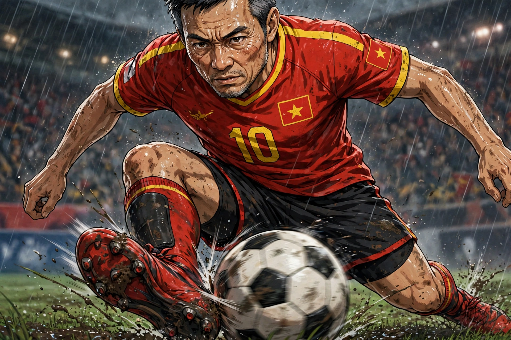
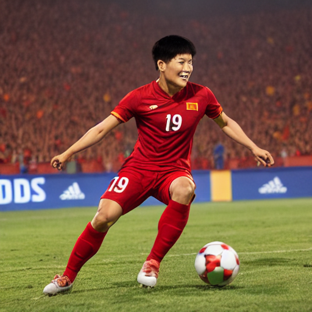

# Football Player Generative AI

Dự án cá nhân dùng **Stable Diffusion 1.5** và **LoRA** để tạo hình ảnh cầu thủ bóng đá Việt Nam theo phong cách anime, cinematic và action từ prompt. Mục tiêu là giữ lại các đặc trưng của chủ đề bóng đá như áo đấu, số áo, sân vận động và tư thế thi đấu.

## Demo

### Ảnh trong dataset



### Ảnh được tạo bằng Stable Diffusion 1.5 + LoRA



Ảnh mẫu được tạo ở độ phân giải 512x512 với LoRA scale mặc định là `0.8`.

## Pipeline

```text
Dataset ảnh cầu thủ Việt Nam + caption
                |
                v
       Kohya_ss train LoRA
                |
                v
Stable Diffusion 1.5 + football_player_v1.safetensors
                |
                v
        Local inference bằng inference.py
                |
                v
       Ảnh PNG trong inference_outputs/
```

## Tính năng

- Huấn luyện LoRA trên bộ dữ liệu cầu thủ bóng đá Việt Nam.
- Tạo ảnh cầu thủ phong cách anime/cinematic bằng prompt.
- Hỗ trợ điều chỉnh prompt, negative prompt, số bước sinh ảnh, CFG scale, LoRA scale và seed.
- Tự động chọn checkpoint LoRA `.safetensors` mới nhất trong `outputs/lora/`.
- Hỗ trợ chạy GPU CUDA và fallback sang CPU.
- Có tối ưu bộ nhớ bằng VAE slicing và CPU offload khi `accelerate` khả dụng.

## Kết quả hiện tại

LoRA hiện tại cho kết quả tốt ở các đặc điểm:

- Phong cách anime.
- Chủ đề bóng đá và các tư thế thi đấu.
- Bối cảnh sân vận động và cảm giác cinematic.
- Áo đấu và số áo ở mức khá tốt.

Các chi tiết nhỏ như logo, họa tiết áo và số trên quần đôi lúc chưa chính xác hoàn toàn.

## Cấu trúc chính

```text
.
├── configs/                         # Cấu hình huấn luyện LoRA
├── dataset/VNfootballer/            # Ảnh và caption huấn luyện
├── inference.py                     # Script sinh ảnh local
├── inference_outputs/               # Ảnh sinh ra từ inference
├── models/stable_diffusion/         # Base model SD 1.5 (local)
└── outputs/lora/                    # Checkpoint và sample của LoRA
```

## Cài đặt

Tạo môi trường Python và cài các thư viện cần thiết:

```bash
python -m venv .venv
.venv\\Scripts\\activate
pip install torch diffusers transformers accelerate safetensors Pillow
```

GPU NVIDIA có CUDA được khuyến nghị. Base model và LoRA checkpoint cần được đặt ở các vị trí sau:

```text
models/stable_diffusion/v1-5-pruned-emaonly.safetensors
outputs/lora/football_player_v1.safetensors
```

Các file model lớn được liệt kê trong `.gitignore` để không đưa vào repository.

## Chạy inference

Chạy với prompt mặc định:

```bash
python inference.py
```

Ví dụ tạo một cầu thủ Việt Nam đang sút bóng:

```bash
python inference.py ^
  --prompt "vietnam football player, red soccer uniform, jersey number 19, kicking a ball, stadium, anime cinematic style" ^
  --negative_prompt "low quality, blurry, deformed, text, watermark" ^
  --steps 30 ^
  --cfg_scale 7.5 ^
  --lora_scale 0.8 ^
  --seed 42 ^
  --output_dim 512x512
```

Ảnh sau khi tạo sẽ được lưu với tên dạng:

```text
inference_outputs/sd15_lora_seed42_YYYYMMDD-HHMMSS.png
```

## Huấn luyện LoRA

Cấu hình huấn luyện tham khảo nằm trong `outputs/lora/config_lora-20260906-154740.toml` và cấu hình dự án nằm trong `configs/footballer_lora_512_ep3.toml`.

Một số thông số chính của checkpoint hiện tại:

- Base model: Stable Diffusion 1.5.
- Resolution: 512x512.
- Epochs: 3.
- LoRA network dimension: 16.
- Optimizer: AdamW8bit.
- Learning rate: 1e-4.
- Mixed precision: fp16.
- Seed: 42.

Có thể tiếp tục tinh chỉnh dữ liệu caption, logo áo đấu và khuôn mặt nếu cần độ chính xác cao hơn.

## Trạng thái dự án

Inference local đã hoạt động với checkpoint LoRA hiện tại. Hướng phát triển tiếp theo là kiểm thử thêm ảnh khuôn mặt thật và cải thiện độ ổn định của các chi tiết nhỏ trên áo đấu.
