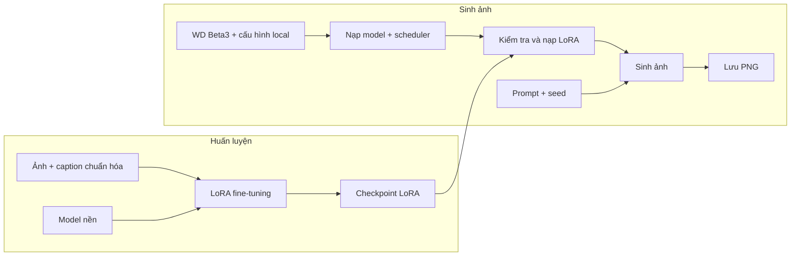

# Football Player Generative AI

## 1. Giới thiệu dự án

Dự án cá nhân tạo ảnh cầu thủ bóng đá Việt Nam theo phong cách **anime** từ mô tả văn bản, sử dụng **Stable Diffusion kết hợp LoRA fine-tuning**. Phạm vi gồm chuẩn bị dữ liệu, huấn luyện LoRA và xây dựng pipeline suy luận local.

Dự án đã thử nghiệm **Stable Diffusion 1.5**; pipeline hiện tại dùng **Waifu Diffusion (WD) 1.5 Beta3**, thuộc họ **SD2**, với `v_prediction`. Hai nhóm model và LoRA được lưu riêng.

## 2. Công nghệ sử dụng

| Công nghệ | Vai trò |
|---|---|
| Python, PyTorch, CUDA | Xây dựng pipeline, xử lý tensor và chạy model trên GPU |
| Hugging Face Diffusers, Transformers, PEFT | Nạp Stable Diffusion, text encoder, tokenizer, scheduler và adapter LoRA |
| LoRA, `networks.lora` | Fine-tuning; mã công cụ sd-scripts tại `tools/sd-scripts/` |
| Safetensors, NumPy, Pillow | Đọc checkpoint, kiểm tra trọng số và lưu ảnh |
| TensorBoard | File log huấn luyện được lưu trong `outputs/logs/` |

## 3. Kiến trúc hệ thống



Huấn luyện điều chỉnh model theo chủ đề cầu thủ. Suy luận kiểm tra, nạp model và LoRA, rồi sinh ảnh. Các bước được tách thành module trong [src/inference/](src/inference/).

## 4. Dataset và huấn luyện

Dataset hiện có **540 ảnh và 540 caption**, chia thành **18 thư mục**, mỗi thư mục 30 cặp cùng basename. Ảnh tập trung vào cầu thủ nam và trang phục bóng đá. Caption một dòng mô tả ngoại hình, hành động, góc nhìn và nền; cả 540 caption dùng tiền tố `vnfootballer, anime style, Vietnamese male football player`.

Thông số dưới đây đọc từ metadata checkpoint **LoRA WD Beta3 cuối**:

| Thông số | Giá trị |
|---|---|
| Model nền | `wd-beta3-base-fp16.safetensors`, `sd_v2_v` |
| Độ phân giải cấu hình | 768×768; bật bucket |
| LoRA rank / alpha | 16 / 8 |
| Epoch / bước đã lưu | 8 / 10.800 |
| Learning rate UNet / text encoder | `1e-4` / `2e-5` |
| Optimizer / precision / scheduler | AdamW / fp16 / cosine |
| Seed / repeat | 42 / 5 |
| Caption | Shuffle; giữ 3 token đầu |

Repeat 5 tương ứng 2.700 lượt ảnh mỗi epoch. Nhóm LoRA SD 1.5 trước đó có thiết lập 512×512, rank/alpha 16/16 và AdamW8bit. Lệnh và môi trường huấn luyện gốc **chưa xác minh đầy đủ**.

## 5. Kết quả thực nghiệm

Dự án lưu **24 ảnh PNG**, **4 checkpoint SD 1.5** và **8 checkpoint WD**. Dưới đây là ba ảnh từ `inference_outputs/`; bấm vào ảnh để xem PNG gốc.

| Toàn thân anime · 768×1024 | Áo đấu · 768×768 | Chân dung · 768×768 |
|:---:|:---:|:---:|
| [](inference_outputs/20261007_014932_824971_seed42_01.png) | [](inference_outputs/20261007_014433_155628_seed42_01.png) | [](inference_outputs/20260928_215053_459217_seed42_01.png) |

Ảnh toàn thân thể hiện phong cách anime, áo đỏ và sân vận động. Hạn chế quan sát được: số áo–quần không nhất quán, khung hình bị cắt ở mẫu áo đấu và phong cách khuôn mặt khác nhau giữa các mẫu.

PNG thiếu metadata đầy đủ về checkpoint, prompt và cấu hình sinh, nên **chưa thể so sánh công bằng giữa các epoch**. Chưa có đánh giá định lượng về chất lượng hoặc danh tính cầu thủ. Bản JPEG trong `assets/` giữ nguyên kích thước và bố cục.

## 6. Cấu trúc dự án

```text
.
├── src/inference/       # Cấu hình, validator, loader, scheduler, generator
├── test_inference.py    # Script chạy xuyên suốt và kiểm tra PNG
├── configs/             # Cấu hình huấn luyện SD 1.5 cũ
├── dataset/VNfootballer/ # Ảnh–caption (local)
├── models/              # Model nền và cấu hình Diffusers (local)
├── outputs/lora/        # Hai nhóm checkpoint SD 1.5 và WD
├── outputs/logs/        # Log huấn luyện
├── inference_outputs/   # PNG kết quả
├── assets/              # Ảnh minh họa cho README
└── tools/sd-scripts/    # Mã công cụ huấn luyện (local)
```

## 7. Cài đặt và sử dụng

Dùng **Python 3.12** và **PyTorch có CUDA** phù hợp với máy. Thiết lập tham khảo từ thư mục gốc:

```powershell
py -3.12 -m venv .venv
.\.venv\Scripts\python.exe -m pip install torch diffusers==0.33.1 transformers==4.54.1 accelerate==1.6.0 peft==0.20.0 safetensors==0.4.5 numpy Pillow
```

Tải `wd-beta3-base-fp16.safetensors` và các file cấu hình từ [kho WD Beta3 trên Hugging Face](https://huggingface.co/waifu-diffusion/wd-1-5-beta3/tree/main). Đặt checkpoint tại `models/stable_diffusion/wd-1-5-beta3/`; đặt `model_index.json` cùng các thư mục cấu hình `scheduler/`, `text_encoder/`, `tokenizer/`, `unet/`, `vae/` trong thư mục con `config/`. Giữ đầy đủ file tokenizer; trọng số model nền và dataset được Git ignore.

Chạy với checkpoint LoRA WD cụ thể:

```powershell
.\.venv\Scripts\python.exe test_inference.py "outputs/lora/lora_wf1.5_beta3/vnfootball_anime_wd15_v1 (1).safetensors"
```

Script dùng mặc định **768×1024, 30 bước, CFG 7.5, seed 42, Euler ancestral** và lưu PNG trong `inference_outputs/`. Chỉnh prompt và tham số tại [GenerationConfig](src/inference/config.py); script chỉ nhận đối số checkpoint, chưa có cờ CLI khác.

Chưa có lockfile được kiểm chứng; `.venv` local thiếu interpreter gốc nên chưa chạy lại inference.

## 8. Vấn đề kỹ thuật và giải pháp

- **LoRA Conv2d 1×1 không khớp Linear:** checkpoint chứa tensor 4D tại `proj_in/proj_out`, trong khi pipeline yêu cầu 2D. Validator kiểm tra kernel, rank và kích thước; loader chuyển đúng tensor được chấp thuận trong bộ nhớ, giữ nguyên file checkpoint và xác nhận adapter sau nạp.
- **Lỗi chuyển đổi OpenCLIP:** ghi chú thực nghiệm ghi nhận Diffusers 0.32.1 tách Q/K/V theo `projection_dim=512` thay vì `hidden_size=1024`. Dự án chuyển sang 0.33.1; mã thư viện local dùng `hidden_size` đúng với cấu hình text encoder.
- **Kiểm soát model và trạng thái adapter:** loader ghi nhận SHA-256 model nền; validator đối chiếu WD chuẩn, module/tensor và yêu cầu pipeline chưa gắn LoRA. Script báo lỗi theo từng pha.

## 9. Hướng phát triển

- Lưu prompt, seed, cấu hình và checkpoint cùng ảnh để đánh giá qua từng epoch.
- Bổ sung CLI, lockfile và quy trình tái lập huấn luyện.
- Đánh giá tính nhất quán khuôn mặt, trang phục; thử nghiệm IP-Adapter với ảnh tham chiếu. IP-Adapter hiện có cấu hình và asset, chưa tích hợp suy luận.
